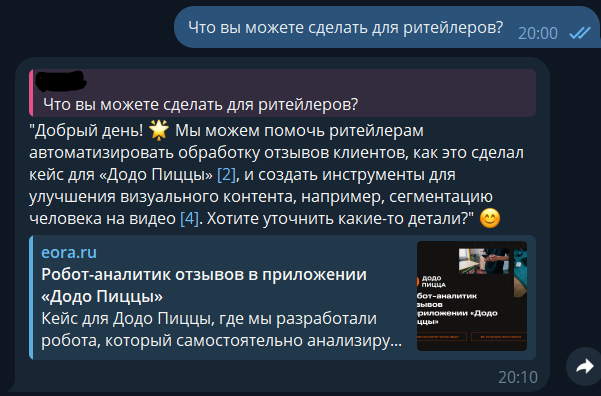

# rag_cli_bot
Телеграм бот + LLM RAG система, консультант по рабочим кейсам компании

- Пробовал сделать cложный кейс. Дать ответ на вопрос и ссылки на используемые файлы, приложив их напрямую к местам в тексте

- Создал систему RAG (Retrieval Augmented Generation), развернул локально нейросетевую модель с пмощью ollama использовал модель qwen3:8b и embedd nomic-embed-text
В проекте не используется API облачных сервисов.
Это решение выбрано намеренно, чтобы:
 - избежать расходов на API-запросы,
 - сохранить полную автономность и приватность данных,
 - иметь возможность работать без интернета.

Что не очень:
Возможно поработал бы ещё с промптом, чтобы качество ответа было более живым и настоящим
Не хватило времени сделать так, чтобы ссылки индексировались с 1 и не были бы привязаны к конкртеному списку

- Я тестировал программу по вопросу из примера, так как в примере он написан человеком и в сравнение с ним, лучше видна разница как генерирует модель и как было написано человеком.
Мои основные критерии оценки:
1. Качество и объём ответа
2. Корректность ссылок которые прислал бот
3. Актуальность ссылок
4. Соотвествие вопросу

- Добавил бы при создании чанков и векторов данных функционал очистки данных от лишнего с помощью LLM, также бы поработал над парсингом и отсеял часть мусора попадющего в векторы для улучшение качества ответа нейросети

